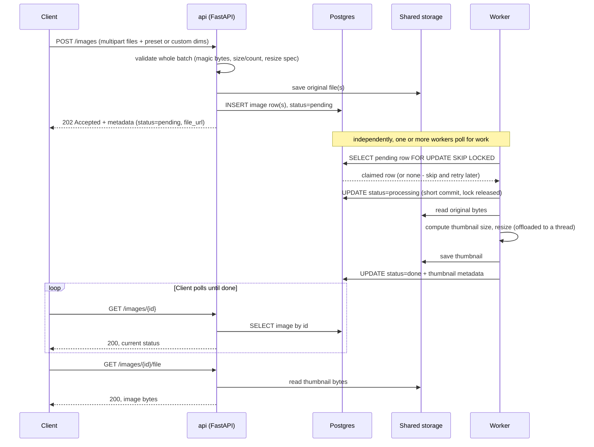
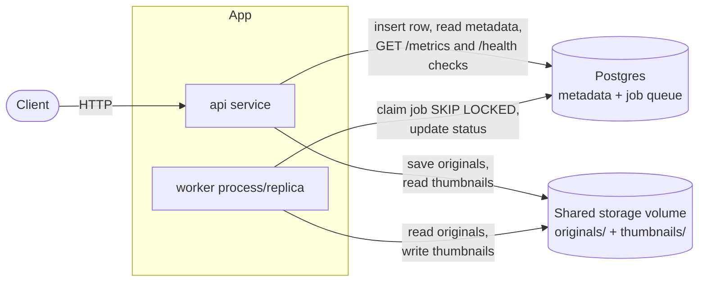

# Architecture

Two processes share a Postgres database and a filesystem: the **api** service (FastAPI) handles HTTP requests and never resizes an image itself, and one or more **worker** processes do the actual (CPU-bound) resizing asynchronously. Postgres doubles as both the metadata store and the job queue — a pending row *is* a queued job, claimed safely under concurrent workers via `SELECT ... FOR UPDATE SKIP LOCKED`.

## Request lifecycle

## Components and data flow

## Why it's structured this way

- **Upload is synchronous, resize is not.** `POST /images` only validates and persists — it returns `202 Accepted` immediately with `status=pending`, rather than making the client wait for a potentially slow resize. This is what lets the API stay responsive under concurrent upload load.
- **Postgres is the queue, not a separate broker.** A `pending` row *is* a queue entry; no second system (Redis, RabbitMQ, etc.) is needed for this scale. `FOR UPDATE SKIP LOCKED` lets any number of worker processes safely race for the same pool of pending rows with no double-claiming and no blocking between them.
- **The API and worker never resize on the request/event-loop thread.** The worker's resize call and the API's image-dimension read are both CPU-bound and offloaded via `asyncio.to_thread`, so neither process's async event loop is blocked while that work happens — this is what makes `WORKER_CONCURRENCY` (multiple resize slots per worker process) and concurrent request handling actually work, not just appear to.
- **Storage is a shared volume, not local-to-each-container.** The worker reads originals the API saved, and the API later reads thumbnails the worker wrote — so both processes need to see the same storage location, not their own isolated filesystem.
